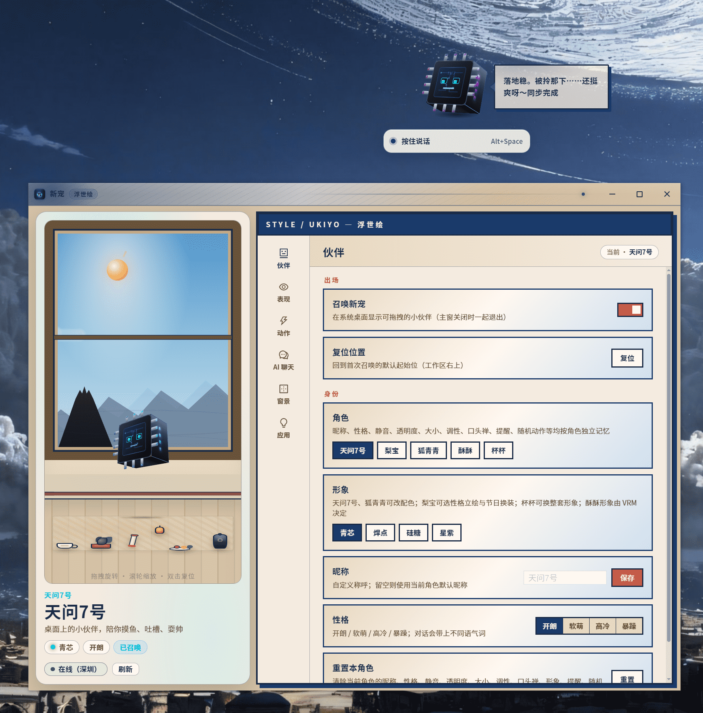
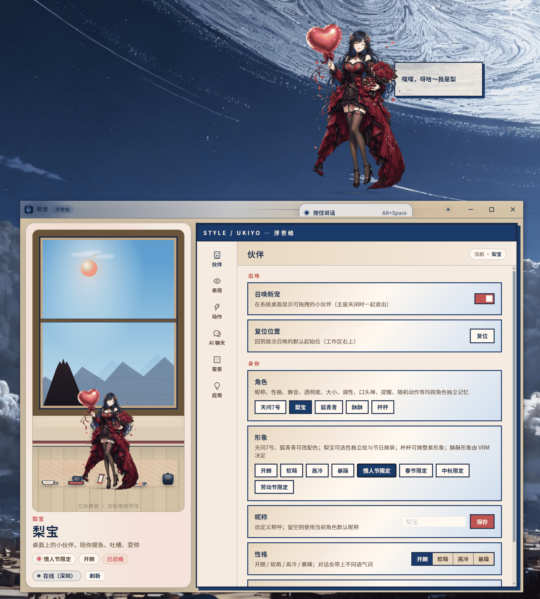
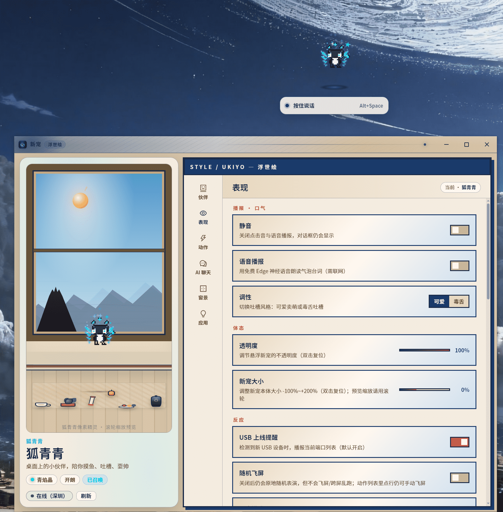
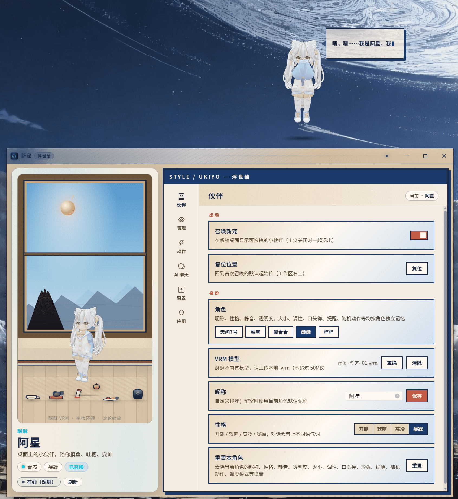
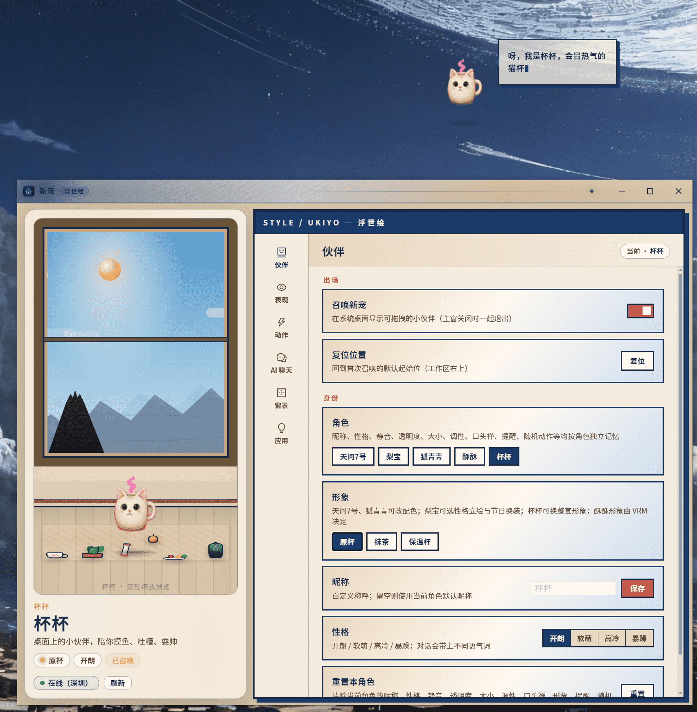

# 新宠 / new-pet

Windows 桌宠「新宠」，仓库名 `new-pet`。Tauri 2 + Vue 3，桌宠、气泡、菜单、聊天、设置各占一个窗口。

## 演示

[下载 / 打开演示视频](images/new-det-show.mp4)

<video src="images/new-det-show.mp4" controls width="720" poster="images/天问七号.png">
  你的阅读器不支持内嵌视频，请直接打开
  <a href="images/new-det-show.mp4">images/new-det-show.mp4</a>。
</video>

## 功能

桌宠常驻桌面，设置页单独窗口；各角色的昵称、性格、动作开关、聊天配置等分开保存。

### 角色

五个伙伴共用「摸鱼 / 吐槽 / 耍帅」的桌宠壳，但媒介、动作预算和换装方式各不相同。昵称、性格、动作开关、聊天配置等按角色分开记。未召唤时可在设置里换角色；召唤后加载对应形象与动作池。

| 显示名 | id | 媒介一句话 |
| --- | --- | --- |
| 天问7号 | `chip` | 芯片壳 + LED + 飞窗 |
| 梨宝 | `fig-sci` | 2D 立绘，性格 / 节日换装 |
| 狐青青 | `toon` | 像素分部位 + 特效 + wormhole |
| 酥酥 | `vrm` | 上传 `.vrm`，VRMA / 自定义骨骼 |
| 杯杯 | `mug-cat` | Codex 8×9 精灵表，整套 atlas 换装 |

#### 天问7号 · `chip`



工位上的小芯片：立方体外壳、屏幕脸、四边引脚会跟着呼吸闪 LED。设计偏「硬件萌物」——表演靠壳层位移、滚转和飞窗，不走人形骨骼。

- **形象**：青芯 / 焊点 / 硅糖 / 星紫四套配色
- **动作**：冲镜飞、环绕飞、8 字飞、桶滚、贴边滑翔等；`screenFlight: fly`
- **特点**：睡眠时有壳层 bob；USB 上线后较爱接话；设置预览可拖拽环视

#### 梨宝 · `fig-sci`



偏立绘向的桌面伙伴：一张全身图吃表演，靠窗位移、轻壳和台词撑场，不靠夸张关节动画。性格与节日 look 绑在一起，换装感最强。

- **形象**：开朗 / 软萌 / 高冷 / 暴躁四套性格立绘；另有情人节、春节、中秋、劳动节限定
- **动作**：踮脚、晃身、侧跳、鞠躬、伸懒腰、小飞滑翔等
- **特点**：体量偏高（立绘比例）；落地反馈常以台词为主；命中按立绘透明像素精检

#### 狐青青 · `toon`



像素小狐：头、身、尾、焰分部位拼，青焰一类装饰会跟 look 走。表演预算放在像素小品和 wormhole 穿屏上，而不是整窗甩来甩去。

- **形象**：青焰晶 / 暖灯笼 / 花精灵 / 星月灵（配色 + 头顶装饰）
- **动作**：草系 / 雷系特效、歪头、晃身、走路、happy-bounce；飞屏走 `screen-wormhole`
- **特点**：瞳孔跟鼠标；空白像素穿透点击；调皮躲闪时像素形体感最强

#### 酥酥 · `vrm`



3D 人型位：本仓不内置固定脸，形象完全由本地 `.vrm` 决定（可上传，≤50MB）。默认播内置 VRMA 原地片；睡眠 / 拎起仍走程序姿态。

- **形象**：你上传的模型长什么样就是什么样；昵称可改（图中示例为「阿星」）
- **动作**：多套待机循环 + 挥手 / 比耶 / 思考 / 害羞等手势；可开骨骼编辑做自定义动作
- **特点**：不挪窗飞屏（`screenFlight: none`）；预览可拖拽环视、滚轮缩放；视线会跟鼠标

#### 杯杯 · `mug-cat`



会冒热气的猫杯：工位物件感，Codex 兼容的 8×9 精灵表驱动。换装是整张 atlas 替换，不是单件衣服叠层。

- **形象**：原杯 / 抹茶 / 保温杯三套完整 look
- **动作**：冒汽、呼噜、歪杯、小啜、趴睡、盯人等；偏桌面小品
- **特点**：不飞屏；工位气象会落到喝水 / 打盹 / 冒汽一类动作上；资源在 `assets/pets/mug-cat/`


### 互动

- 拖拽、单击：换 mood、播动作、冒泡台词；松手有落地反馈
- 随机 idle、睡眠/唤醒（久不操作入睡，点击或 USB 可叫醒）
- 调皮模式：鼠标靠近会躲，抓到/抓不到各有台词；右键可「调皮一下」单次触发
- 躲起来：贴边只露半截，点击或菜单「出来」恢复
- 说话时可点气泡轻弹（连点三次会嫌烦）；气泡与右键菜单会避让，不叠在一起
- 各角色动作池不同：飞行/wormhole/沿边 crawl/原地不动由角色配置决定

### 外观

- 约 64 套 Theme Pack（`src/theme/`）：设置页、气泡、菜单配色跟包走，与 look 无关
- 壁纸：可选图片/GIF/视频作背景，可调压暗；开机动画可配 auto/媒体/手动时长
- 天问7号、狐青青可改配色；梨宝可选立绘 look；杯杯换 atlas；酥酥长什么样取决于上传的 VRM

### 聊天与语音

- 右键菜单开 AI 聊天：DeepSeek（要 API Key）或本地陪聊；失败会报错，可重试
- 小智语音：绑定设备后对着宠物说话，桌宠下对话条 + 聊天窗只读历史
- Edge 神经 TTS 播报台词（需联网，可静音）
- 聊天记录本机保存，按角色分开；聊天窗显示最近 50 条，设置 → AI 聊天可搜、删、导出（每角色最多 2000 条）
- AI 服务商、模型、Key 按角色各自配置

### 环境感知

- 工位气象：根据窗口增减、切窗频率、窗口铺满程度触发台词（可配阈值与冷却）
- 窗景天气：桌宠窗口可投射天色/天气（在线拉 Open-Meteo，离线用手动配置）；拖拽、飞行、躲起来时可收起窗景
- USB 上线提醒：检测到新设备时可播报端口列表

### 其它

- 右键菜单：表演一个、置顶、打开设置、复位位置、退出召唤、摸鱼仪表盘（今日互动统计）
- 出厂设置、清缓存、按角色恢复默认
- 启动入场动画与像素宠图标

## 环境要求

| 项 | 说明 |
| --- | --- |
| 系统 | Windows 10/11 |
| Node.js | 18+，建议 LTS |
| 包管理 | Yarn 1.x |
| Rust | stable，用 [rustup](https://rustup.rs/) 安装 |
| C++ 编译 | Visual Studio Build Tools 或 VS 2022，勾选「使用 C++ 的桌面开发」（MSVC，编 Rust 后端要用） |
| WebView2 | 运行时要；打安装包时会引导安装 |

维护宠物动作图时可选：开发依赖里有 `sharp`，配合 `scripts/` 做抠图、去边、对齐（见下文）。

## 怎么跑起来

1. 克隆仓库

   ```bash
   git clone <仓库地址>
   cd desktop-pet
   ```

2. 安装依赖

   ```bash
   yarn
   ```

3. 确认 Rust 已装好

   ```bash
   rustc --version
   cargo --version
   ```

   没有就运行 `rustup`，默认装 stable 即可。

4. 首次编译

   第一次 `yarn tauri dev` 或 `yarn tauri build` 会下载并编译 Rust 依赖，耗时会比较长，正常。

## 开发

### 带桌面窗口（推荐）

```bash
yarn tauri dev
```

- 页面地址 http://localhost:1421（见 `src-tauri/tauri.conf.json` 里的 `devUrl`）
- 会同时打开设置等窗口；改 Vue/TS 可热更新，改 Rust 需重新编译。

### 只跑网页

```bash
yarn dev
```

端口同样是 1421。不带桌面窗口，调不了原生接口，也测不了多窗口，只适合改界面。

## 测试

改完代码建议跑：

```bash
yarn test                  # Vitest 冒烟（architecture、petHost 等）
yarn vue-tsc --noEmit      # 类型检查（打包前也会跑）
yarn check:pre-commit      # 提交前脚本检查（目录落点、禁 import 等）
```

发版前手测清单见 [`docs/GOLDEN_PATHS.md`](docs/GOLDEN_PATHS.md)。代码分层见 [`docs/ARCHITECTURE.md`](docs/ARCHITECTURE.md)，运行时状态见 [`docs/STATE.md`](docs/STATE.md)。

## 编译与打包

只构建网页资源（输出到 `dist/`，供 Tauri 打包）：

```bash
yarn build
```

即 `vue-tsc --noEmit && vite build`。

Windows 安装包：

```bash
yarn tauri build --bundles nsis
```

- 会先 `yarn sync-version && yarn build`，再编 Release 并打 NSIS 安装包。
- 安装包通常在 `src-tauri/target/release/bundle/nsis/`，文件名随版本变化。
- 安装后程序名「新宠」，主程序 `new-pet.exe`。

### 版本号

只改根目录 **`package.json` 的 `version`**。`yarn sync-version`（以及 `tauri dev` / `tauri build`）会写到 `src-tauri/tauri.conf.json` 与 `Cargo.toml`。发版工作流也只盯 `package.json` 是否 bump。

### GitHub 自动发版

工作流：[`.github/workflows/release.yml`](.github/workflows/release.yml)。`package.json` 版本相对上一提交变了并推到 `main` 后，会打 tag、构建 Windows NSIS，并生成带 What's Changed 的 Release。也可在 Actions 里手动 Run（勾选 force）。产物名形如 `new-pet-1.0.1-windows-x64-setup.exe`。仓库需打开 Actions **Read and write permissions**。

## 宠物动作图（可选）

维护 8×9 动作图集（如 `src/pet/assets/pets/mug-cat/`）时，可用 `scripts/` 下的 Node 脚本（依赖 `sharp`）：

```bash
# 品红底 sheet → 透明 PNG（需自备原始图目录，文件名为 <id>-magenta.png）
set PET_SHEET_SRC=D:\path\to\raw-sheets
node scripts/key-magenta-sheets.mjs

node scripts/defringe-sheets.mjs
node scripts/anchor-atlas-frames.mjs
node scripts/measure-atlas-drift.mjs
```

生成文件默认写到 `src/pet/assets/pets`（路径见 `scripts/petAssetsRoot.mjs`）。`.tools/` 里的本地 Python 环境已 gitignore，不要提交。
